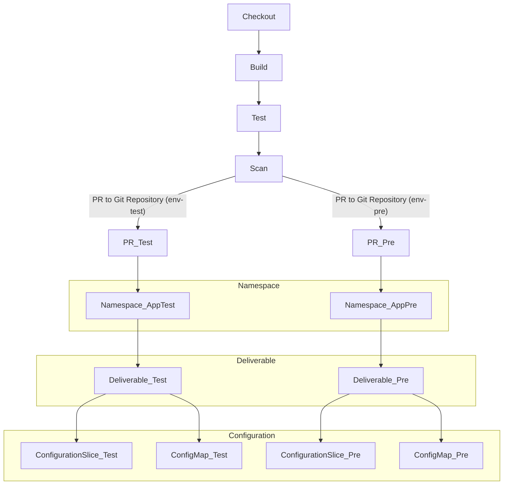

# Automated GitOps Environment Promotion for DotNet app in ADO via TAP

## Diagram


```sh
           +-----------+     +-----------+
           |  Checkout | --> |   Build   |
           +-----------+     +-----------+
                 |                |
                 v                v
            +------+         +-----------+
            | Test |         |   Scan    |
            +------+         +-----------+
                               |
                               v
    +----------------------+   +-----------------------+
    | PR to Git Repository |   | PR to Git Repository |
    |    (env-test)        |   |     (env-pre)        |
    +----------------------+   +-----------------------+
                 |                          |
                 v                          v
      +------------------+    +------------------+
      |   Namespace      |    |    Namespace     |
      |   (App-Test)     |    |     (App-Pre)    |
      +------------------+    +------------------+
          |                      |
          v                      v
      +------------+          +------------+
      | Deliverable|          | Deliverable|
      +------------+          +------------+
      +--------------+     +--------------+
      | Configuration|     | Configuration|
      |  Slice       |     |  Slice       |
      +--------------+     +--------------+
      +--------------+     +--------------+
      | ConfigMap    |     | ConfigMap    |
      +--------------+     +--------------+

```


